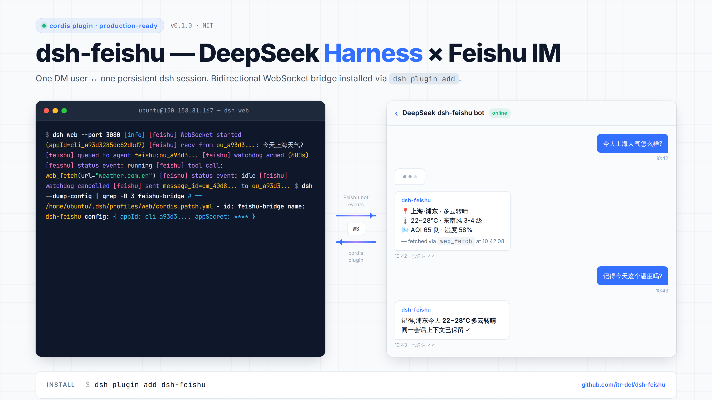

# dsh-feishu — Feishu (Lark) IM bridge for DeepSeek Harness

> Pluggable cordis plugin wiring a Feishu self-built bot into a running
> [DeepSeek Harness (dsh)](https://github.com/deepseek-ai/deepseek-harness) `web`
> profile — installable via `dsh plugin add`.

```
┌────────┐   WS    ┌──────────────┐   cordis    ┌──────────┐    LLM    ┌──────────┐
│ Feishu │ ──────> │  this plugin │ ──────────> │ dsh agent │ ────────> │ DeepSeek │
│  IM    │ <────── │              │ <────────── │          │ <──────── │          │
└────────┘   API   └──────────────┘  events     └──────────┘  stream   └──────────┘
```



## Features

- One Feishu DM user ↔ one persistent dsh session (`feishu:<open_id>`).
- Multi-turn conversations across reconnects.
- Streams assistant replies back into Feishu, chunked at 4000 chars.
- Filters DeepSeek `<|DSML|...>` tool-call markers from outbound text.
- Pure ESM, no TypeScript compile step.
- No telemetry, fully local.

## Installation

### 1. Install dsh

```bash
npm install -g @deepseek-ai/dsh
dsh web --help
```

### 2. Install the plugin

```bash
dsh plugin add dsh-feishu
```

This installs the plugin into `~/.dsh/profiles/web/node_modules/dsh-feishu` and
patches `cordis.patch.yml` automatically.

### 3. Configure your Feishu app

Create a Custom App at <https://open.feishu.cn/app> and copy `appId` + `appSecret`.

Under **Event Subscriptions (事件与回调)**:
- Set mode to **Receive events via persistent connection (使用长连接接收事件/回调)**.
- Add the event `im.message.receive_v1`.

Under **Permissions (权限)**, grant:
- `im:message`
- `im:message.p2p_msg` (required for DMs)

**Publish a version (发布版本)** — without this the bot cannot receive events.
Wait ~2 minutes after publishing.

### 4. Export env vars and run

```bash
export DEEPSEEK_API_KEY="sk-..."
export FEISHU_APP_ID="cli_..."
export FEISHU_APP_SECRET="..."

dsh web
```

You should see in logs:

```
[feishu] WebSocket started (appId=cli_xxx)
[feishu] FeishuBridgeService initialized
```

DM the bot anything — the agent will reply in the same conversation.

## Environment variables

| Variable | Required | Default | Notes |
|---|---|---|---|
| `DEEPSEEK_API_KEY` | yes (LLM) | — | <https://platform.deepseek.com> |
| `DEEPSEEK_BASE_URL` | no | `https://api.deepseek.com` | For proxies |
| `FEISHU_APP_ID` | yes | — | `cli_xxx` from app console |
| `FEISHU_APP_SECRET` | yes | — | From app console — **never commit** |

## How a message flows

1. User DMs the bot.
2. Feishu SDK fires `im.message.receive_v1` → this plugin.
3. Plugin loads/creates the agent for `feishu:<open_id>`.
4. Plugin calls `agent.followup(userMessage)`.
5. When agent returns to `idle`, plugin reads `agent.session.events`, strips
   DSML noise, and posts the reply via `larkClient.im.message.create(...)`.

## Limitations

- **Text only.** Image / file / card / post messages are not handled.
- **No streaming.** Reply sent after turn completes.
- **No groups yet.** DMs only.

## License

MIT.

## Acknowledgments

- [DeepSeek Harness (dsh)](https://github.com/deepseek-ai/deepseek-harness) — the agent runtime this plugin extends.
- [@larksuiteoapi/node-sdk](https://github.com/larksuite/node-sdk) — official Feishu (Lark) SDK, MIT licensed.
- [DeepSeek API](https://platform.deepseek.com) — LLM backend.

## Author

[itr-del](https://github.com/itr-del) — `13918029394@163.com`

Built while integrating dsh with a self-hosted Feishu bot on Ubuntu 22.04.

📖 **Open-sourcing story**: [PUBLISHING.md](./PUBLISHING.md) — how this repo got published and listed.

中文文档见 [README.zh.md](./README.zh.md)。